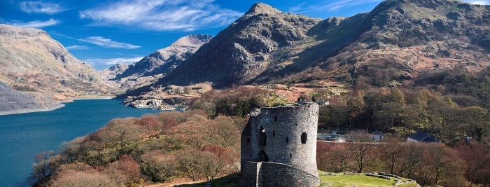

# Journeys

Sometimes I like to go on journeys, visit historic sites, museums, or just get some nice scenery. I tend to take pictures when ever I go to one of these places, not necessarily good pictures bear in mind, but still,  I'd like to improve my photography and writing to share these historic locations and their  dinnseanchais.

