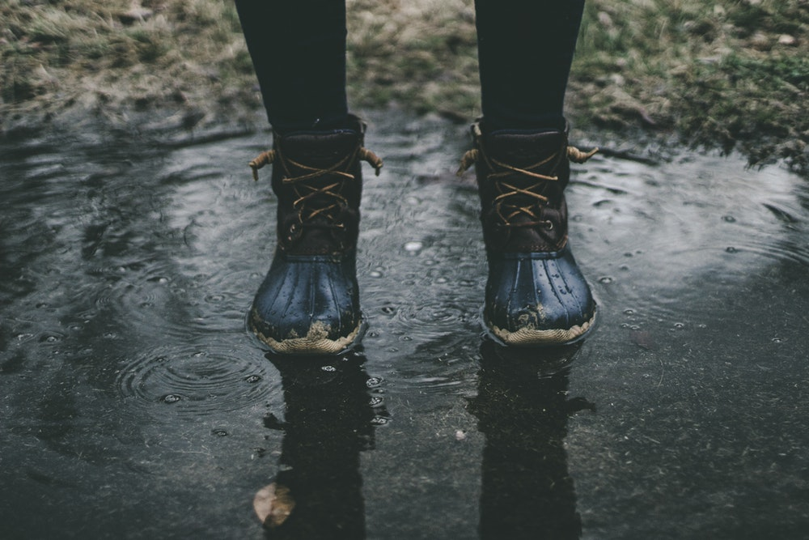

# The Best Bits

Quite frankly medieval Irish literature is downright cool, and weird, and gory, and very confusing. This is where I'm going to discuss all my favourite bits for the rest of the world to be as awed and confused as I am.

> "The heat of the fire and the air and the seething of the ground aided the water so that the pool that was in the middle of the house turned into a worm, and after that the worm became a purple fly. " - Tochmarc Étaíne

